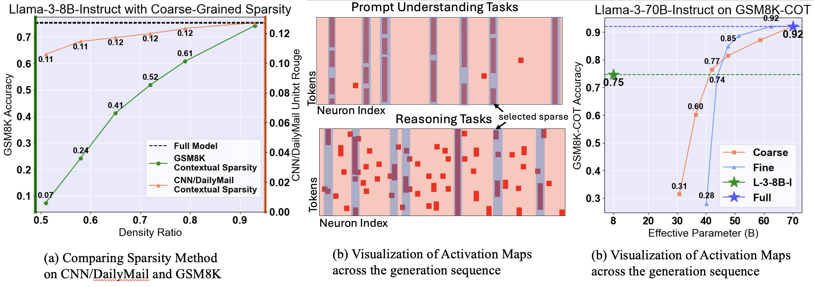

<div align="center">
<h1> Sirius: Contextual Sparsity <br>with Correction for Efficient LLMs
</h1>
</div> 
Sirius, an efficient correction mechanism, which significantly boosts Contextual Sparsity models on reasoning tasks while maintaining its efficiency gain.
<div align="center">
<b><a href="https://github.com/YangZhou08">Yang Zhou</a></b><sup>1</sup>,
<b><a href="https://github.com/dreaming-panda">Zhuoming Chen</a></b><sup>1</sup>,
<b><a href="https://github.com/Ottovonxu">Zhaozhuo Xu</a></b><sup>2</sup>,
<b><a href="">Victoria Lin</a></b><sup>3</sup>,
<b><a href="https://github.com/keroro824">Beidi Chen</a></b><sup>1</sup>,
</div> 

<div align="center">
<sup>1</sup>Carnegie Mellon University
<sup>2</sup>Stevens Institute of Technology
<sup>3</sup>Meta AI (FAIR)
</div>

<div align="center">
[<a href="">Paper</a>] | [<a href="https://infini-ai-lab.github.io/Sirius/">Blog</a>]
</div>

<h3>Problem of Contextual Sparsity</h3> 
<div align="center">

<figcaption>Contextual Sparsity Weakness in Complex Reasoning Tasks</figcaption> 
</div> 
In this paper, we evaluate Contextual Sparsity (CS) models comprehensively on various complex generation tasks. 
CS models are evaluated at their default sparsity (50% neuron sparsity). Across the evaluation, we present the following takeaways: 
<ol>
<li>CS models work well on prompt understanding tasks, e.g. text summarization (CNN/DailyMail) and conversation question answering (CoQA). </li>
<li><span style="font-weight: bold;">CS models significantly ill-perform on generation tasks that require complex reasoning </span> (GSM8K) or knowledge-based tasks (MMLU-FLAN-COT). </li>
<li>The problem in complex reasoning generation tasks escalates for more well-trained model, given the similar parameter count. </li>
</ol> 

<h3>Effectiveness of Sirius</h3> 
Sirius is proposed to effectively boost the weakness of CS on complex generation tasks on reasoning, while maintaining the efficiency of CS models. Sirius is evaluated on 6 models with 8 different complex tasks ranging from arithmetic reasoning, commonsense reasoning, and code generation. (More detailed results, please refer to the paper). Below we show briefly the results for <a href="meta-llama/Meta-Llama-3-8B-Instruct">Llama-3-8B-Instruct</a> on GSM8K, CSQA, and HumanEval. 
<table style="font-size: 12px">
                <caption>Llama-3-8B-Instruct with Sirius Effectiveness on Different Complex Tasks</caption>
                <thead>
                  <tr>
                    <th colspan="7" style="color: dodgerblue">GSM8K</th>
                  </tr>
                  <tr>
                    <th>Model</th>
                    <th>Full Perf.</th>
                    <th>CSparse Perf.</th>
                    <th>CSparse Density</th>
                    <th>Sirius Perf.</th>
                    <th>AAL</th>
                    <th>Effective Density</th>
                  </tr>
                </thead>
                <tbody>
                  <tr>
                    <td>Llama-3-8B-Instruct</td>
                    <td>0.7536</td>
                    <td>0.3844</td>
                    <td>0.65</td>
                    <td>0.7051 (8)</td>
                    <td>15.22/16</td>
                    <td>0.706</td>
                  </tr>
                  <tr>
                    <th>Model</th>
                    <th>Full Perf.</th>
                    <th>FSparse Perf.</th>
                    <th>FSparse Density</th>
                    <th>Sirius Perf.</th>
                    <th>AAL</th>
                    <th>Effective Density</th>
                  </tr>
                  <tr>
                    <td>Llama-3-8B-Instruct</td>
                    <td>0.7536</td>
                    <td>0.5868</td>
                    <td>0.76</td>
                    <td>0.7278 (4)</td>
                    <td>15.37/16</td>
                    <td>0.807</td>
                  </tr>
                  <tr>
                    <th colspan="7" style="color: dodgerblue">CSQA</th>
                  </tr>
                  <tr>
                    <th>Model</th>
                    <th>Full Perf.</th>
                    <th>CSparse Perf.</th>
                    <th>CSparse Density</th>
                    <th>Sirius Perf.</th>
                    <th>AAL</th>
                    <th>Effective Density</th>
                  </tr>
                  <tr>
                    <td>Llama-3-8B-Instruct</td>
                    <td>0.7073</td>
                    <td>0.6470</td>
                    <td>0.58</td>
                    <td>0.7076 (8)</td>
                    <td>14.76/16</td>
                    <td>0.657</td>
                  </tr>
                  <tr>
                    <th>Model</th>
                    <th>Full Perf.</th>
                    <th>FSparse Perf.</th>
                    <th>FSparse Density</th>
                    <th>Sirius Perf.</th>
                    <th>AAL</th>
                    <th>Effective Density</th>
                  </tr>
                  <tr>
                    <td>Llama-3-8B-Instruct</td>
                    <td>0.7073</td>
                    <td>0.6158</td>
                    <td>0.72</td>
                    <td>0.7043 (8)</td>
                    <td>15.66/16</td>
                    <td>0.753</td>
                  </tr>
                  <tr>
                    <th colspan="7" style="color: dodgerblue">HumanEval</th>
                  </tr>
                  <tr>
                    <th>Model</th>
                    <th>Full Perf.</th>
                    <th>CSparse Perf.</th>
                    <th>CSparse Density</th>
                    <th>Sirius Perf.</th>
                    <th>AAL</th>
                    <th>Effective Density</th>
                  </tr>
                  <tr>
                    <td>Llama-3-8B-Instruct</td>
                    <td>0.561</td>
                    <td>0.207</td>
                    <td>0.65</td>
                    <td>0.524 (8)</td>
                    <td>14.67/16</td>
                    <td>0.733</td>
                  </tr>
                  <tr>
                    <th>Model</th>
                    <th>Full Perf.</th>
                    <th>CSparse Perf.</th>
                    <th>CSparse Density</th>
                    <th>Sirius Perf.</th>
                    <th>AAL</th>
                    <th>Effective Density</th>
                  </tr>
                  <tr>
                    <td>Llama-3-8B-Instruct</td>
                    <td>0.561</td>
                    <td>0.457</td>
                    <td>0.76</td>
                    <td>0.616 (6)</td>
                    <td>15.42/16</td>
                    <td>0.804</td>
                  </tr>
                </tbody>
</table> 

<h4>On-Chip Generation Speedup</h4>
Sirius is able to deliver the promised latency reduction. We focus on <span style="font-weight: bold">generation-only</span> setting. Below are some partial results for the on-chip setting with GSM-8K-COT. For the specific experiment setup, please refer to the paper. 
<table style="font-size: 12px">
                <caption>Llama-3-8B-Instruct On-Chip Wallclock Latency Speedup</caption>
                <thead>
                    <tr>
                        <th>Settings</th>
                        <th>Performance</th>
                        <th>A40</th>
                        <th>Speedup Ratio</th>
                        <th>L40</th>
                        <th>Speedup Ratio</th>
                        <th>Performance</th>
                        <th>A100</th>
                        <th>Speedup Ratio</th>
                    </tr>
                </thead>
                <tbody>
                    <tr>
                        <td>Coarse-grained Sparsity</td>
                        <td>0.3601</td>
                        <td>20.7</td>
                        <td>0.85</td>
                        <td>15.6</td>
                        <td>0.67</td>
                        <td>0.3601</td>
                        <td>9.6</td>
                        <td>0.72</td>
                    </tr>
                    <tr>
                        <td>Sirius</td>
                        <td>0.7127</td>
                        <td>24.1</td>
                        <td>0.77</td>
                        <td>18.2</td>
                        <td>0.78</td>
                        <td>0.7089</td>
                        <td>11.1</td>
                        <td>0.83</td>
                    </tr>
                    <tr>
                        <td>Full</td>
                        <td>0.7612</td>
                        <td>30.9</td>
                        <td>1.0</td>
                        <td>23.2</td>
                        <td>1.0</td>
                        <td>0.7612</td>
                        <td>13.3</td>
                        <td>1.0</td>
                    </tr>
                </tbody>
            </table>

<h4>Offloading Setting Speedup</h4> 
We also show the speedup for the <a href="meta-llama/Meta-Llama-3-70B-Instruct">Llama-3-70B-Instruct</a> on GSM-8K-COT with PCIE 25 GB/s. 
<div align="center">
<table>
                        <caption style="font-weight: bold; margin-bottom: 10px;">Llama-3-70B-Instruct with Offloading</caption>
                        <thead>
                            <tr>
                                <th>Settings</th>
                                <th>Sparse</th>
                                <th>Sirius</th>
                                <th>Full</th>
                            </tr>
                        </thead>
                        <tbody>
                            <tr>
                                <td>Performance</td>
                                <td>0.7407</td>
                                <td>0.8719</td>
                                <td>0.9014</td>
                            </tr>
                            <tr>
                                <td>Latency (s)</td>
                                <td>3.57 s</td>
                                <td>3.68 s</td>
                                <td>5.72 s</td>
                            </tr>
                            <tr>
                                <td>Ratio to Full</td>
                                <td>0.6241</td>
                                <td>0.6434</td>
                                <td>1.0</td>
                            </tr>
                        </tbody>
                    </table>
                    </div> 

<h3>Overview of the Code</h3> 
<h4>Environment Setup</h4> 
<pre>
<code>pip install -r requirements.txt 
pip install flash-attn --no-build-isolation </code> 
</pre>
On special package to notice is that since Sirius uses torch.compile to optimize the inference latency, we strictly require PyTorch version to be 2.3.0. 

<h4>Test Sirius Effectiveness and Efficiency Metrics AAL</h4> 

* GSM-8K, GSM-8K-COT, CNN/DailyMail, MMLU-FLAN-COT<br>
We use base our implementation on <a href="https://github.com/EleutherAI/lm-evaluation-harness">LM Evaluation Harness</a> since they support these tasks. The essential blocks are packed in the folder "Miscellaneous". To run the Sirius on various Huggingface models, follow the line. 
<pre>
<code>cd Miscellaneous 
# Full model 
accelerate launch --main_process_port <main_port> --num_processes <num_procs> --num_machines <num_node> main.py --model xhf --model_args pretrained=<huggingface-token-model>,griffin=False,check=False --tasks <tasks_name> --batch_size 1 
# Coarse-grained Sparsity 
accelerate launch --main_process_port <main_port> --num_processes <num_procs> --num_machines <num_node> main.py --model xhf --model_args pretrained=<huggingface-token-model>,griffin=True,check=False --tasks <task_name> --batch_size 1 
# Fine-grained Sparsity 
accelerate launch --main_process_port <main_port> --num_processes <num_procs> --num_machines <num_node> main.py --model xhf --model_args pretrained=<huggingface-token-model>,cats=True,check=False --tasks <task_name> --batch_size 1
# Sirius with Sparse 
accelerate launch --main_process_port <main_port> --num_processes <num_procs> --num_machines <num_node> main.py --model xhf --model_args pretrained=<huggingface-token-model>,griffin=True,check=True,kernel_size=<kernel_size>,widthtree=<width_tree>,patternstrict=True,thr=0.1 --tasks <task_name> --batch_size 1 </code>
</pre> 
For Sirius to be turned on, set <code>check=True</code>. For <code>cats=True</code> and Sirius to have widthtree > 1, <code>patternstrict</code> must set to True. 

* For Commonsense Reasoning tasks, we follow the Chain-of-Thought (https://arxiv.org/abs/2201.11903) work to convert previously multiple-choice question dataset CSQA, StrategyQA, Date and Sports into generation question. The essential block is packed in "CommonSenseReasoning" folder. 
```
cd CommonSenseReasoning
# Sirius with Sparse 
accelerate launch --main_process_port <main_port> --num_processes <num_proc> main.py --tasks <task_name> --model <huggingface_token> --shotfive --cats --check --kernel_size <kernel_size> --spr <sparity> --thr <threshold> --widthtree <widthtree> --patternstrict 
```

